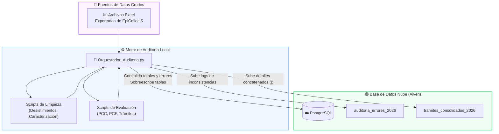
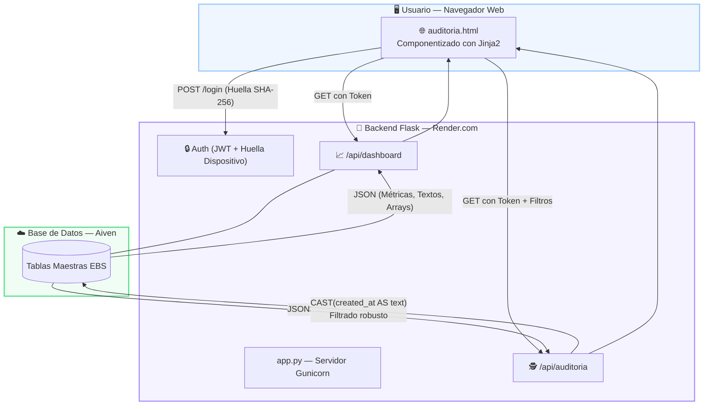

<div align="center">

# 📊 INFORMES & AUDITORÍA — Sistema de Gestión ESE

**Plataforma de inteligencia de negocios y auditoría clínica para Equipos Básicos de Salud (EBS) 2026**


</div>

---

## 📋 Tabla de Contenidos

- [Descripción General](#-descripción-general)
- [Arquitectura del Sistema](#-arquitectura-del-sistema)
- [Estructura del Proyecto](#-estructura-del-proyecto)
- [Fuentes de Datos](#-fuentes-de-datos)
- [Módulos del Sistema](#-módulos-del-sistema)
- [Configuración y Puesta en Marcha](#-configuración-y-puesta-en-marcha)
- [Mantenimiento Diario](#-mantenimiento-diario)
- [Despliegue Web](#-despliegue-web)
- [Seguridad y Rendimiento](#-seguridad-y-rendimiento)
- [Tecnologías y Costos](#-tecnologías-y-costos)

---

## 🎯 Descripción General

**INFORMES ESE** es una plataforma analítica y de auditoría de calidad de datos diseñada para monitorear, auditar y graficar en tiempo real el rendimiento de los **Equipos Básicos de Salud (EBS)** en los territorios y microterritorios.

El sistema evalúa integralmente a los diferentes perfiles (**Enfermería, Medicina, Psicología y Técnico Auxiliar**), garantizando el cumplimiento de los lineamientos del Ministerio de Salud y Protección Social *(Resolución 3280 de 2018)*.

### ¿Qué puede hacer el sistema?

| Funcionalidad | Descripción |
|---|---|
| 📈 **Dashboard Global** | Visualización en tiempo real de métricas poblacionales, demográficas, caracterizaciones y avance general de los microterritorios. |
| 🕵️ **Auditoría Individual** | Filtrado preciso por correo del encuestador y rango de fechas para evaluar su rendimiento exacto. |
| 🏥 **Métricas por Perfil** | Diferenciación inteligente de intervenciones (ej. separando intervenciones generales de las específicas de Psicología). |
| 📝 **Reportes y Errores** | Consolas de texto con los IDs de ficha exactos donde se cometieron errores o se registraron atenciones, listos para copiar al portapapeles. |
| 🖨️ **Generación PDF** | Motor de impresión nativo (`@media print`) que transforma la vista web en un documento formal con membrete institucional. |

---

## 🏗️ Arquitectura del Sistema

La plataforma funciona mediante un modelo **desacoplado**: un Orquestador local en Python consolida y evalúa la calidad de los datos crudos, para luego inyectar los resultados resumidos y limpios a PostgreSQL en la nube, donde Flask los distribuye al Frontend.

### Diagrama 1: ETL y Sincronización (Orquestador → Nube)



### Diagrama 2: Arquitectura Web (Nube → Usuario)



---

## 📂 Estructura del Proyecto

```
/INFORMES                        # 📁 Directorio Principal
│
├── app.py                       # 🐍 Backend Flask (Servidor Principal)
├── requirements.txt             # 📦 Dependencias para Render.com
├── Procfile                     # 🚀 Archivo de arranque para despliegue
├── .env                         # 🔑 Variables de entorno (NO subir a Git)
├── .gitignore                   # 🚫 Excluye .env y archivos sensibles
│
├── login.html                   # 🔒 Interfaz de acceso seguro
├── Dashboard.html               # 📈 Panel global
└── auditoria.html               # 🕵️ Archivo maestro de auditoría y PDF
```

---

## 🗄️ Fuentes de Datos

El sistema evalúa las siguientes entidades de la estrategia APS:

| Entidad / Dimensión | Tablas PostgreSQL asociadas | Documento de Referencia |
|---|---|---|
| **Caracterización** | `caracterizacion_si_aps_familiar_2026`, `caracterizacion_si_aps_individual_2026` | Identificación de población clave |
| **Plan Comunitario** | `pcc_principal_2026`, `pcc_integrantes_2026` | Intervenciones en entornos |
| **Plan Familiar (General)** | `pcf_planes_principal_2026`, `pcf_planes_integrantes_2026` | Seguimiento frecuente |
| **Salud Mental (Psicología)** | `pcf_psicologia_principal_2026`, `pcf_psicologia_seguimientos_2026` | Identificación de riesgos y seguimiento |
| **Gestión / Trámites** | `tramites_consolidados_2026` | Trámites sectoriales e intersectoriales |
| **Auditoría (Log)** | `auditoria_errores_2026` | Consolidación de inconsistencias cruzadas |

---

## 🧩 Módulos del Sistema

### 1. Motor de Consultas Inquebrantable (Backend)
El sistema utiliza conversiones estrictas (`CAST(columna AS text)`) y subcadenas para aislar fechas desde formatos complejos generados por EpiCollect5 (ej. `2026-04-07T23:24:23.000Z`), garantizando cruces perfectos entre rangos de tiempo.

### 2. Auditoría por Perfiles
Separa inteligentemente la producción basada en el perfil del encuestador (**Técnico, Enfermería, Médico, Psicólogo**), verificando los datos dentro de cada módulo normativo.

### 3. Informes Generales y Extracción de Textos
Transforma la base de datos SQL (con separador `|`) en listas de texto ordenadas y comprensibles para reportes de Trámites Resolutivos, Errores, Seguimientos de Psicología e Intervenciones, listas para copiar o imprimir.

### 4. Generador de PDF Institucional
Mediante CSS (`@media print`), oculta la interfaz oscura y los botones, reformateando los elementos web en un informe físico estructurado con el membrete oficial del **Ministerio de Salud** y la **ESE Villavicencio**.

---

## ⚙️ Configuración y Puesta en Marcha

### 1. Requisitos (Máquina Local)

```bash
# Instalar las dependencias estrictas del entorno
pip install -r requirements.txt
```

### 2. Variables de Entorno

Crea un archivo `.env` en el mismo nivel que `app.py`:

```env
# Clave secreta para JWT
SECRET_KEY=tu-clave-super-secreta-para-jwt

# Base de datos NUBE (Aiven PostgreSQL)
DB_USER_AIVEN=avnadmin
DB_PASSWORD_AIVEN=tu_contraseña_aiven
DB_HOST_AIVEN=tu-cluster.aivencloud.com
DB_PORT_AIVEN=13505
DB_NAME_AIVEN=defaultdb

# Puerto de despliegue
PORT_INFORMES=5001
```

> ⚠️ **Nunca subas el archivo `.env` a GitHub.** Asegúrate de incluirlo en tu `.gitignore`.

---

## 🔄 Mantenimiento Diario

```
1. Descarga las bases crudas desde EpiCollect5.
2. Ejecuta el Orquestador Local (Orquestador_Auditoria.py) en tu equipo
   para limpiar, evaluar errores y actualizar las tablas en Aiven.
3. El Dashboard Web reflejará los cambios instantáneamente
   sin necesidad de reiniciar el servidor.
```

---

## 🚀 Despliegue Web

La aplicación está preparada para despliegue en plataforma PaaS (**Render.com**):

1. Sube este repositorio a GitHub asegurándote de que `.gitignore` esté activo (protegiendo el `.env`).
2. En Render, crea un **New Web Service** conectado a tu repositorio de GitHub.
3. Configura el comando de inicio (**Start Command**):
   ```bash
   gunicorn app:app
   ```
4. Ingresa las **Variables de Entorno** de Aiven en la configuración del servicio en Render.

---

## 🔐 Seguridad y Rendimiento

| Mecanismo | Descripción |
|---|---|
| **Device Fingerprinting** | Vincula el login a la huella digital del dispositivo del usuario (SHA-256 basado en hardware/navegador). Evita cuentas compartidas. |
| **Autenticación JWT** | Tokens con expiración configurada para sesiones seguras. |
| **Prevención SQL Injection** | Uso exclusivo de consultas preparadas (`:param`) con SQLAlchemy. |

---

## 🛠️ Tecnologías y Costos

| Componente | Tecnología | Costo |
|---|---|---|
| Base de Datos | PostgreSQL (Aiven) | ✅ Gratis |
| Servidor Backend | Python 3.11 + Flask + Gunicorn | ✅ Gratis |
| Frontend | HTML5, CSS3 avanzado (`@media print`), JS Vanilla | ✅ Gratis |
| Gráficos Analíticos | Chart.js 4.4 | ✅ Gratis |
| Host Web | Render.com | ✅ Gratis |

<div align="center">

### 💚 Costo total de operación del Sistema de Auditoría: **$0**

---

*Módulo INFORMES ESE 2026 — Herramienta de Control de Calidad y Gestión Operativa APS*  
*ESE Villavicencio · Ministerio de Salud y Protección Social · Resolución 3280 de 2018*

</div>
